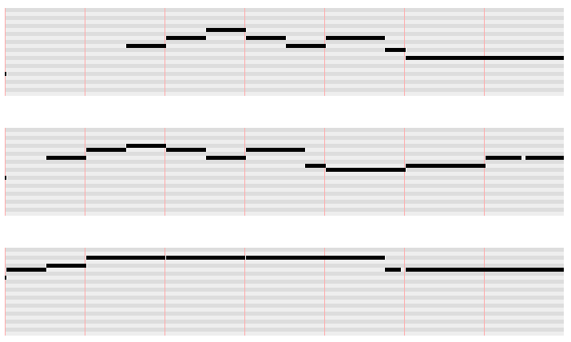

# Printable MIDI notes

This is a script that produces a representation of notes that’s similar to what you see in the Ableton Live MIDI editor. The output is HTML/CSS and can be printed.

I needed this for my singing. There are a couple songs with weird melodies and very long notes, which are hard to read if you use standard musical notation, but which are pretty easy to read if you indicate pitches and lengths geometrically.

## Build

You need a fairly recent version of GHC (Glasgow Haskell Compiler). For Mac OS, the easiest way to get it is to use [GHC for Mac OS X](https://ghcformacosx.github.io/), which is one download that contains everything.

And then you run:

````
cabal sandbox init
cabal install
cabal build
````

It may take a while, because it downloads and compiles the whole internet.

## What it does

The script takes an Ableton Live set file as input. For every MIDI track that contains MIDI clips, it produces an HTML file as output.

It does that by parsing the XML code of an unpacked .als file, extracting MIDI notes from all clips, adjusting start times of notes to make them absolute rather than relative to the clip they are in, slicing all the notes into chunks of time, and then rendering HTML code for each chunk of time. In the browser the chunks are floated left to right via CSS, which results in a resizable, zoomable view.



In this view, every row is a semitone. There is no black-keys/white-keys distinction. The visual length of a note is proportional to its length in time.

## Usage

````
./run <your ableton live .als file>
````

The script generates files named out-<index>.html and (on Mac OS X) opens them in a web browser.
